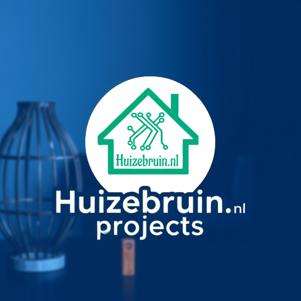

# huizebruin-projecten

| Repository Status | huizebruin-projecten Repo |
| :--- | :--- |
|  [![last commit time][github-last-commit]][github-master] [![GitHub Activity][commits-shield]][commits] |   |
| [![License][license-shield]](LICENSE) [![Forks][forks-shield]][forks-url] [![Stargazers][stars-shield]][stars-url] [![Issues][issues-shield]][issues-url] | [![Contributors][contributors-shield]][contributors-url] 

|   |

## huizebruin-projecten Projects

<!-- @import "[TOC]" {cmd="toc" depthFrom=1 depthTo=6 orderedList=false} -->

## Intro

Wat is huizebruin-projecten.

### De ESPHome projecten die door Huizebruin gemaakt zijn komen hier te staan.

* Ikea Air vindictering
* centrale afzuinging (Binnenkort online)
* mmwave sensor on wemos d1 mini (Binnenkort online)

## Support

Je kan op verschillende manieren contact met me zoeken.

### Github

Maak een "issue" aan. Ik zal zo snel mogelijk regageren

### Discord

Ik ben een actieve member van de Huizebruin Discord groep. Mocht je vragen hebben kun je altijd lid worden van dit kanaal en contact met me zoeken. (wobbe | huizebruin)
En natuurlijk ook in contact komen met meerdere HomeAssistant gebruikers!

[![Discord][discord-shield]][discord]

[commits-shield]: https://img.shields.io/github/commit-activity/m/huizebruin/huizebruin-projecten.svg
[discord]: https://discord.gg/hKPgwWNHwH
[discord-shield]: https://img.shields.io/discord/723629686093119650.svg?logo=discord&color=7289da
[commits]: https://github.com/huizebruin/huizebruin-projecten/commits/main
[github-last-commit]: https://img.shields.io/github/last-commit/huizebruin/huizebruin-projecten.svg?style=plasticr
[github-master]: https://github.com/huizebruin/huizebruin-projecten/commits/main
[license-shield]: https://img.shields.io/github/license/huizebruin/huizebruin-projecten.svg
[contributors-url]: https://github.com/huizebruin/huizebruin-projecten/graphs/contributors
[contributors-shield]: https://img.shields.io/github/contributors/huizebruin/huizebruin-projecten.svg
[forks-shield]: https://img.shields.io/github/forks/huizebruin/huizebruin-projecten.svg
[forks-url]: https://github.com/huizebruin/huizebruin-projecten/network/members
[stars-shield]: https://img.shields.io/github/stars/huizebruin/huizebruin-projecten.svg
[stars-url]: https://github.com/huizebruin/huizebruin-projecten/stargazers
[issues-shield]: https://img.shields.io/github/issues/huizebruin/huizebruin-projecten.svg
[issues-url]: https://github.com/huizebruin/huizebruin-projecten/issues
